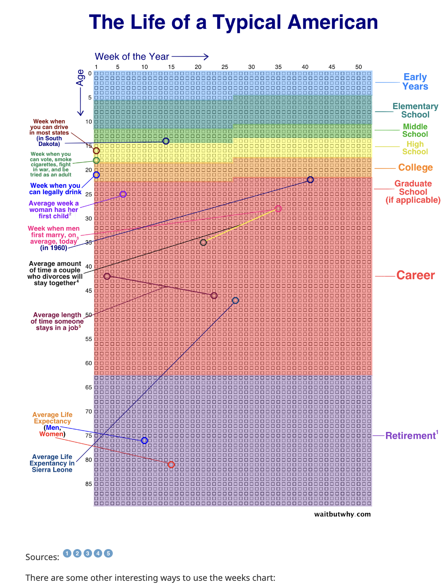
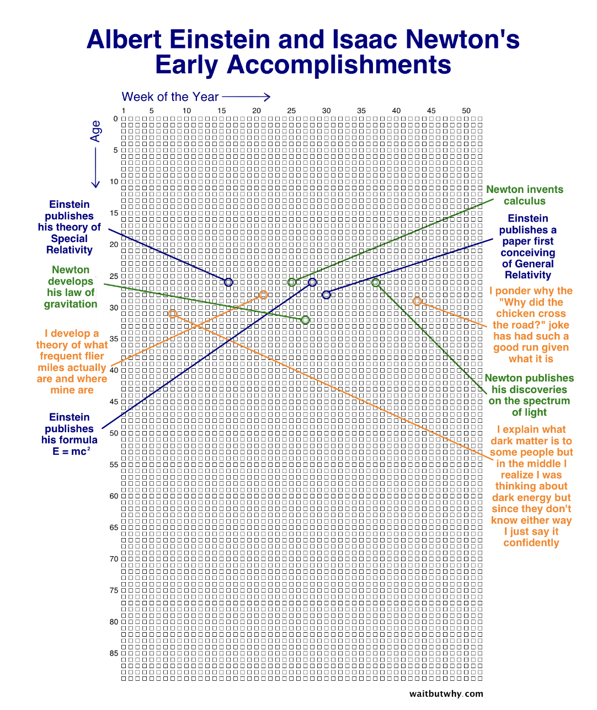

## Obsidian Day-in-the-life Plugin

  

"Obsidian Day-in-the-life Plugin" is a simple Historical Log plugin for Obsidian (https://obsidian.md).

  

Inspired by the Your-Life-in weeks Calendar by XKCD. With the Day-in-theplife plugin, you can better evaluate your time managemnent by candidly staring at how much life you've already lived(and wont get back) moreover, how much time you have left to reach your goals.

This first submission is the app in it's purest most simple form. I intend to add more subjects of reflection when considering how aligned your reality is with the tragectory you wish to accomplish. For now this app only showcases the word count you submitted on each daily note as a metric for self progress.

  

Get better optics on your lifespan and how urgent it is to seize the day.

  
  

  

> The Your-Life-In weeks calendar was first showcased by Tim Urban on his popular blog Wait But Why? (to my knowledge)

> I always found it both strinking and grounding to stand in my truth when comparing my sense of tragectory when directly facing the simplicity of this interface. It's scary, humbling, and energizing to comprehend how to utlize the rest of my days and perhaps make up for lost time. People define their reality often by milestons by a certain age. I intended to continually version the app to include a multitude of optics from which you can compare yourself to your goals, accomplishments, and life outlooks in a truthful way. I hope this lense of reality helps inspires you to seize the day like it does for me.

  
  

If you are not familiar with this calendar, see the original:

> https://waitbutwhy.com/2014/05/life-weeks.html

  

  
  

You can track the word count by hovering over the calendar to activate the tool tip. I will also soon enale other tracking mechnnaisms related to [[backlinks]], tags# and timestamps.

  
  
  

## Thanks to

  

- Tokuhiro Matsuno, for having a pomodoro plugin that helped me learn how to get started with obsidian sample plugin. <tokuhirom@gmail.com>

- nivo.rocks for having an awesomely aesthetic visualitation library with a MIT license.

  

### Manually installing the plugin

  

- Run `npm build`

- Copy over `main.js`, `styles.css`, `manifest.json` to your vault `VaultFolder/.obsidian/plugins/your-plugin-id/`.

  

## LICENSE

  

The MIT License (MIT)

  

Copyright © 2023 Seth McGaugh

  

Permission is hereby granted, free of charge, to any person obtaining a copy

of this software and associated documentation files (the “Software”), to deal

in the Software without restriction, including without limitation the rights

to use, copy, modify, merge, publish, distribute, sublicense, and/or sell

copies of the Software, and to permit persons to whom the Software is

furnished to do so, subject to the following conditions:

  

The above copyright notice and this permission notice shall be included in

all copies or substantial portions of the Software.

  

THE SOFTWARE IS PROVIDED “AS IS”, WITHOUT WARRANTY OF ANY KIND, EXPRESS OR

IMPLIED, INCLUDING BUT NOT LIMITED TO THE WARRANTIES OF MERCHANTABILITY,

FITNESS FOR A PARTICULAR PURPOSE AND NONINFRINGEMENT. IN NO EVENT SHALL THE

AUTHORS OR COPYRIGHT HOLDERS BE LIABLE FOR ANY CLAIM, DAMAGES OR OTHER

LIABILITY, WHETHER IN AN ACTION OF CONTRACT, TORT OR OTHERWISE, ARISING FROM,

OUT OF OR IN CONNECTION WITH THE SOFTWARE OR THE USE OR OTHER DEALINGS IN

THE SOFTWARE.