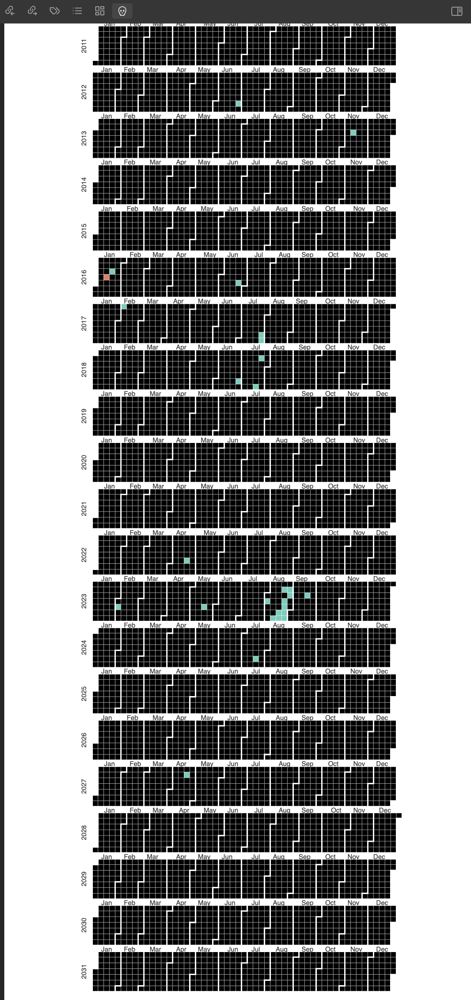

## Obsidian Day-in-the-life Plugin

The "Day in the Life" calendar is a simple Calendar plugin for Obsidian (https://obsidian.md).

Inspired by the "Your-Life-in Weeks" calendar by Tim Urban on his popular blog "Wait But Why?". This plugin aims to expand upon these optics in a configurable, light-hearted way.

If you are not familiar with this calendar, see the original:

> https://waitbutwhy.com/2014/05/life-weeks.html

With the "Day in the Life" plugin, you can more relevantly evaluate your time management by candidly staring at how much life you've already lived(and won't get back) given your unique circumstances. Moreover, a reminder of the amount time you have left to reach your goals. 

 I always found it both striking and grounding to stare at the simplicity of this calendar which many consider a piece of art. It helps me stand in my truth when comparing my sense of trajectory. It's scary, humbling, and energizing to comprehend how I might utilize the rest of my days and perhaps even make up for lost time. People define their reality often by milestones (of arbitrary value) by a certain age(s). I hope plugin serves as a stark reminder of life's brevity and that it helps inspire you to seize the day like it does for me.

Current state:
This first submission is the app in it's purest most simple form. 
How to use:
- Located in the top right-hand corner menu icon. Once expanded the plugin can be activated by clicking the skull icon.
- You can view which daily notes have contents within them by just glimpsing at the color gradient over each box. The color gradient indicates how much effort you put into your notes that day (tracks word count among other things).
- Hovering over a colored box will give you insights into that daily note with the tooltip feature. 
- Then "On Click" you will open that daily note in a separate tab. 
- Within the settings are whimsical data entry fields that go into a calculation that projects the range of your lifespan onto the calendar (this has nothing to do with your *actual* likelihood of longevity. It's a rudimentary measuring stick based on historical evidence of the average human.) 

Future State:
- Adjustable/dynamic calendar views to increase and decrease granularity of the calendar
	- 24 hour calendar
	- 7 day calendar 
	- 52 week calenar(life in weeks grid/consolidate aesthetics into a view that doesn't require any scrolling)
- Reduce memory leakage and performance issues I am experiencing with the nivo library.
	- especially, fix graph conflict. I am currently using the nivo library to render the calendar. I am having issues with the graph rendering on top of the calendar. I am not sure if this is a z-index issue or something else. I am not sure if I will continue to use the nivo library or if I will just use the calendar library. I am open to suggestions.
- More optics. In the settings there will be more input fields to configure your outlook on your timeline. I intend to add more subjects of reflection, average life milestones, finacial trajectory markers, and a multitude of other optics perteninnet to planning your human experience optimally. Again, this is so that you can compare yourself against your goals, accomplishments, and life outlooks in a truthful way. I want people to journal & goal set when considering how aligned your reality is with the trajectory you wish to accomplish. For now this app only showcases the word count you've submitted on each daily note as a metric for self progress. 
- Add newsticker or loading splash screen reminders with inspirational quotes like: 

"Your perspective is your reality"

"Be the change you wish to see"

"carpe diem"

etc.

---
  
## Thanks to

  
- Obsidian for fostering a plugin community that is vibrant and can extrapolate upon itself.
- Tokuhiro Matsuno, for having a pomodoro plugin that helped *me* learn how to get started with obsidian sample plugin. I certainly draw inspiration everywhere.
- nivo.rocks for having an awesomely aesthetic visualization library with a MIT license.

  

### Manually installing the plugin

- Run `npm build`
- Edit this app locally: `npm run dev`
- Copy over `main.js`, `styles.css`, `manifest.json` to your vault `VaultFolder/.obsidian/plugins/your-plugin-id/`.
- NOTE: While in your finder, you made need to "unhide" the ".obsidian" directory by using command+shift+. on the keyboard of your macOS.  

  

## LICENSE

The MIT License (MIT)

Copyright © 2023 Seth McGaugh  

Permission is hereby granted, free of charge, to any person obtaining a copy of this software and associated documentation files (the “Software”), to deal in the Software without restriction, including without limitation the rights to use, copy, modify, merge, publish, distribute, sublicense, and/or sell copies of the Software, and to permit persons to whom the Software is furnished to do so, subject to the following conditions: The above copyright notice and this permission notice shall be included in all copies or substantial portions of the Software.

THE SOFTWARE IS PROVIDED “AS IS”, WITHOUT WARRANTY OF ANY KIND, EXPRESS OR

IMPLIED, INCLUDING BUT NOT LIMITED TO THE WARRANTIES OF MERCHANTABILITY,

FITNESS FOR A PARTICULAR PURPOSE AND NONINFRINGEMENT. IN NO EVENT SHALL THE

AUTHORS OR COPYRIGHT HOLDERS BE LIABLE FOR ANY CLAIM, DAMAGES OR OTHER

LIABILITY, WHETHER IN AN ACTION OF CONTRACT, TORT OR OTHERWISE, ARISING FROM,

OUT OF OR IN CONNECTION WITH THE SOFTWARE OR THE USE OR OTHER DEALINGS IN

THE SOFTWARE.
